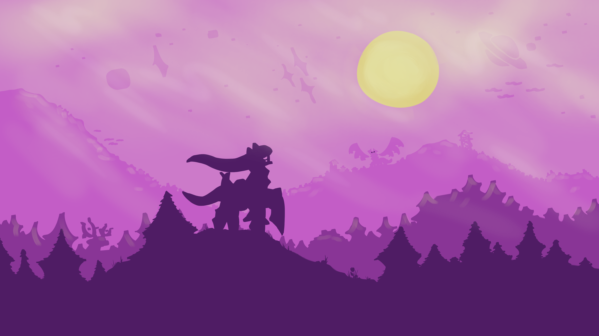

---
hide:
  - navigation
---

# Welcome to Pokémon Inritum

This is the official documentation and info hub for **Pokémon Inritum**.

Here you will be able to find details about the custom fields used in battles, details about each hessian variant and zeta species.

We will also share development updates to keep you updated on the progress for the next release!

## About the game
In the land of **Hessia**, where some rare Pokémon wield unimaginable strength, players are drawn into a gripping narrative that delves into the depths of existential philosophy.

As you journey through this richly crafted world, you'll uncover the mysteries of the region's troubled past and confront the dark machinations of a **nefarious religious cult**.

With the guidance of a renowned professor studying the genetic potential of Pokémon, players must navigate a web of deception and betrayal, all while testing their skills in intense Pokémon battles against formidable opponents.

Along the way, you'll encounter a cast of intriguing characters, each with their own motivations and agendas, as you unravel the secrets hidden within the **Zeta Pokémon**.

But beware, for the cult's sinister leader, guided by the Philosophy of Redemption, seeks to harness the power of Arceus to bring about the end of existence itself.

**Will you stand against the tide of darkness? Or will you succumb to the allure of power and darkness, shaping the fate of the region and its inhabitants?**

### Features

- **Full custom OST** - Our song tracks were carefully designed to match the maps and feeling we want the players to feel!
- **Generation 9** - Every Pokémon will be available to catch with lots of events to explore!
- **Quest system** - Explore the region in a fruitful fashion earning rewards and accessing rarer Pokémon by completing side quests!
- New variants and mega evolutions only available in Hessia region!
- Some event Pokémon can come with egg moves!
- Huge and complex story with **18 gym leaders**!
- In-game speed-up with 3 different options.
- Choices that will impact the history and how the game will develop - Right and wrong are never just black and white.
- **New field types** with complex effects, like Rejuvenation and Reborn!
- QoL features such as **nature changer NPC**, **EV training facilities**, and more!

Explore the game’s unique mechanics, characters, and world!

## Inritum Team
- **BloodyNeonz** -> Lead developer
- **Ajax** -> The mastermind behind the Inritum plot
- **Gothmonkey** -> The best musician on the planet, responsible for the OST
- **Robonox** -> The intern spriter that got promoted to main spriter in the same week
- **Syntaxx** -> Spriter, mapper, juggler, honestly I'm not sure what he doesn't do
- **Sunny** -> Our weirdly talented spriter
- **Dada** -> Concept artist that help us bring our ideas to life

### Previous members
- **WolfLuna** -> Concept artists and BG artist

## Community

- 🎮 [Join the Discord](https://discord.gg/QQJmu4wkxe)
- 💬 Follow development on [EeveeExpo](https://eeveeexpo.com/threads/8336/)
- 💬 Follow development on [PokéCommunity](https://www.pokecommunity.com/threads/pok%C3%A9mon-inritum.532504/)
- 🧪 Help out by play-testing and sending feedback!

## Frequently Asked Questions

1. **How long is the playthrough?**

    Right now episode 1 consists of:

    - Prologue to introduce our main characters, the region, and the outline of the plot.
    - Progress until the first gym.
    - The first mission as part of the lab research team.
    - One extra map where the next episode will take place.

2. **Where can I report bugs?**

    Join the Discord and post them in the #community-feedback channel.

3. **Is this a completed game?**

    Currently in development – Episode 1 is out now!