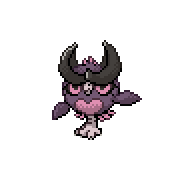

# Hessian Hoothoot

## Pokédex Data

- **Type:** Dark / Fairy
- **Height:** 0.7 m || **Weight:** 22.4 kg
- **Abilities:**
    1. **Insomnia:** The Pokémon's insomnia prevents it from falling asleep.
    2. **Keen Eyes:** The Pokémon's keen eyes prevent its accuracy from being lowered.
    3. **Hidden Ability - Prankster:** Gives priority to the Pokémon's status moves.

**Base Stats:**
<table style="border-collapse: separate; border: 3px solid #3e1692; border-radius: 10px; background: #7e56c2; width: 100%; color: #000; font-size: 14px;">
  <thead>
    <tr>
      <th style="padding: 8px;">Stat</th>
      <th colspan="3" style="padding: 8px;"></th>
      <th style="padding: 8px;">Base</th>
    </tr>
  </thead>
  <tbody>
    <tr style="background: #9EE865;"><td>HP</td><td colspan="3" style="width: 300px;">

</td><td>60</td></tr>
    <tr style="background: #F5DE69;"><td>Attack</td><td colspan="3">

</td><td>30</td></tr>
    <tr style="background: #F09A65;"><td>Defense</td><td colspan="3">

</td><td>30</td></tr>
    <tr style="background: #66D8F6;"><td>Sp. Atk</td><td colspan="3">

</td><td>36</td></tr>
    <tr style="background: #899EEA;"><td>Sp. Def</td><td colspan="3">

</td><td>56</td></tr>
    <tr style="background: #E46CCA;"><td>Speed</td><td colspan="3">

</td><td>50</td></tr>
    <tr style="background: #7e56c2; font-weight: bold;"><td>Total</td><td>262</td><td colspan="3"></td></tr>
  </tbody>
</table>

## Evolution

Hessian Hoothoot evolves into [Hessian Noctowl](noctowl.md) at level 20.

## Level Up Moves

| Level | Move            |
|-------|-----------------|
| 1     | Disarming Voice |
| 1     | Gust            |
| 7     | Air Cutter      |
| 8     | Screech         |
| 10    | Thief           |
| 12    | Hone Claws      |
| 15    | Alluring Voice  |
| 18    | Calm Mind       |
| 23    | Psychic Noise   |
| 25    | Air Slash       |
| 30    | Tailwind        |

## Pokédex Entry

> "A forest trickster, Hessian Hoothoot tend to live in dense and dark forests. They often scare hikers with their ethereal cries."
